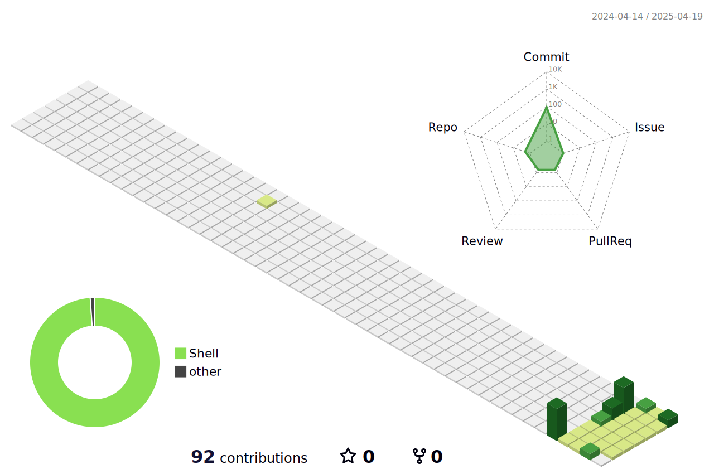

📢 Nominate ([@Ashita-no-lonewolf](https://github.com/Ashita-no-lonewolf/Ashita-no-lonewolf/tree/main)) as **[GitHub Star](https://stars.github.com/nominate)**. If you appreciate his hard work and dedication to open source.

<a href="https://www.linkedin.com/in/kaushar-halani-904804354 " target="_blank"><!-- </a>-->

<p align="center"></p> 

#  Hello, my name is Kaushar Halani).

<p>
    <a href="https://github.com/Ashita-no-lonewolf/Ashita-no-lonewolf"></a>
    <a href="https://github.com/Ashita-no-lonewolf/Ashita-no-lonewolf/graphs/contributors"></a>
    <a href="https://github.com/Ashita-no-lonewolf/Ashita-no-lonewolf/stargazers"></a>
    <a href="https://github.com/Ashita-no-lonewolf/Ashita-no-lonewolf/network/members"></a>
       
</p>

Hey! 👋 I'm a student learning data analysis 📊 and starting to try out open source 💻. On my GitHub, you'll see:

My data projects, where I'm practicing my skills 📈.

My first attempts at contributing to open source projects 💡.

I'm excited to learn and work with others! Let's build cool stuff together! 🚀

## 📧 You can contact me on:

[](https://www.linkedin.com/in/kaushar-halani-904804354 )

_I am open to new opportunities/contributions._

## 🔎 You can find me on:

<a href="mailto:halanikaushar@gmail.com"></a>
[](https://www.linkedin.com/in/kaushar-halani-904804354 )
<!--[](https://dmitrii-selikhov.vercel.app/) -->

<!--## 🔖 Featured repositories:

[](https://github.com/idimetrix/idimetrix)
[](https://github.com/idimetrix/cv)
[](https://github.com/idimetrix/awesome-talents)
[](https://github.com/idimetrix/awesome-job-boards)

<p align="center"></p> -->

## Personal stats:

#### A pre-finale student with a strong foundation in computer science and a developing expertise in data analysis. Eager to contribute to and learn from the open-source community, with a focus on applying analytical skills to real-world projects.
<details>
  <summary>Highlights / Proficiencies / Interests / Believes</summary>

Highlights:

- ⭐ Developing proficiency in data analysis techniques.
- ⭐ Active learner in open-source contribution workflows.
- ⭐ Building a portfolio of data analysis projects.
- ⭐ Eager to learn new tools and technologies.
- ⭐ Master new technologies, master computer science and mathematics

Proficiencies:

- 📚 Python (Pandas, NumPy, Scikit-learn).
- 📚 SQL for data querying.
- 📚 Data visualization tools (e.g., Matplotlib, Seaborn).
- 📚 Basic understanding of machine learning concepts.
- 📚 Git and version control for open-source contributions.
- 📚 Basic understanding of statistical analysis.

Interests:

- ✔️ Self-education and self-development: Continuously seek opportunities for personal growth, self-improvement, and acquiring new knowledge and skills to stay at the forefront of industry trends and advancements.
- ✔️ Family: Place great importance on nurturing and cherishing family bonds, fostering strong relationships, and maintaining a healthy work-life balance to support personal well-being and fulfillment.
- ✔️ Expanding data analysis skills through practical projects.
- ✔️ Contributing to open-source data science initiatives.
- ✔️ Learning from experienced data analysts and developers.
- ✔️ Exploring new data visualization techniques.
- ✔️ Gaining knowledge on Machine learning.
  
Big believer in:

- 💡 Power of continuous learning and personal growth
- 💡 Importance of cultivating a positive mindset and embracing optimism
- 💡 Value of hard work and perseverance in achieving success
- 💡 Power of empathy and kindness in fostering meaningful connections and creating a harmonious society
- 💡 Importance of ethical behavior and integrity in all aspects of life
- 💡 The power of collaborative learning in open source.
- 💡 Continuous skill development through practical application.
- 💡 The value of contributing to projects that have a positive impact.

</details>

## My Skills:

</p>
<ul>
<li>Frontend</li>
</ul>
<p align="left">
  <a href="https://skillicons.dev">
    
  </a>
</p>
<ul>
<li>Backend</li>
</ul>
<p align="left">
  <a href="https://skillicons.dev">
    
  </a>
</p>

<ul>
<li>Database</li>
</ul>
<p align="left">
  <a href="https://skillicons.dev">
    
  </a>
 </p> 
 <ul>
 <li>Data Analysis</li>
 </ul>
<p align="left">
  <a href="https://skillicons.dev">
     
  </a>
</p>

<ul>
<li>Cloud Servers</li>
</ul>
<p align="left">
  <a href="https://skillicons.dev">
    
  </a>
</p> 
<ul>
<li>Tools and Ide's</li>
</ul>
<p align="left">
  <a href="https://skillicons.dev">
    
  </a>
</p>
<!--   GitHub stats graph -->

### 📈 GitHub Activity Graph:


<!--   profile-green-animate -->

  


<p align="center">
  <a href="https://github.com/aoaydin">
    
    <br/>
    
  </a>
</p>





<div align="center">
<summary>Trophy: Github Profile Trophy</summary>
</div>

<p align="center"> 
<a href="https://github.com/ryo-ma/github-profile-trophy"></a>
</p>


  
 
### Profile Views

counting of visitors to this page in this section started from March 22, 2025


</br>

[MIT](LICENSE)

<p align="center"></p>

## _If you liked my profile, you can Star ⭐ the repo and if you want to use this template you can Fork it and can use._

Would you like to meet me?

If you want to contribute to any of my repositories, feel free to submit PRs, issues and email me. Pick a slot if you'd like to meet me and chat about proposals and ideas - but make sure to describe the agenda

<p align="center"></p>

## _I use an automatic subscription control system. Thus, everyone who subscribes to me, I will subscribe to those and I will respond, and vice versa, I will remove all those who unsubscribe from me from among those who should be followed._

<p align="center"><strong>Connect With Us</strong></p>

<p align="center">
<a href="mailto:halanikaushar@gmail.com">
</a>
<a href="https://www.linkedin.com/in/kaushar-halani-904804354 ">

</a>
<!--<a href="https://elevanceit.com/">

</a> -->
</p>

```TypeScript
// Check if the code is functioning correctly

// Let's ensure the code is the epitome of excellence
if (isCodeWorking) {
    console.log("✨ Code works! Time to polish it until it shines.");
    // Perfection is our destination, so onward we go!
    while (codeQuality < perfection) {
        codeQuality++; // Increment the code quality score
        console.log(`Improving... Code quality now at ${codeQuality}.`);
    }
    console.log("🏆 Code has reached perfection!");
}

// The cycle of life: eat, sleep, repeat
while (alive) {
    eat();
    sleep();
    console.log("Repeat! Because life is a loop. 🍎💤🔁");
}

// - Kaushar
```


<!-- Custom Footer -->


